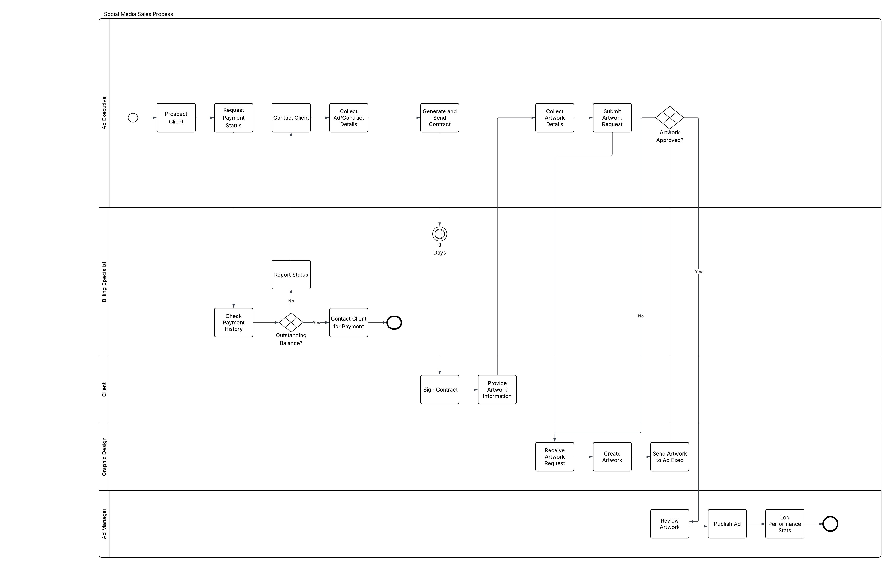

# Social Media Ad Sales Process — BPMN Analysis

## The Process

The organization I analyzed is a media company that specializes in digital and print 
advertising. The advertising manager oversees a team of five ad executives who handle 
everything from prospecting new clients to getting their ads posted. The process I am 
modeling is their social media ad sales workflow — from the first point of contact with 
a potential client through to a published ad and logged performance data, seen through 
the perspectives of the ad executives, billing specialist, graphic design department, 
and ad manager.

This cycle matters to the business because ad sales revenue is the core driver for 
their office. Every inefficiency is a delay between a signed contract 
and money collected; every miscommunication between roles is a potential client 
lost. With five ad executives all running this process simultaneously, small 
points of friction can build quickly across the team. This diagram also serves as a 
practical onboarding tool, as new hires can reference it to familiarize themselves with 
the full workflow before handling their first client.

## The Current State- What's Inefficient

The first bottleneck appears before the ad executive makes contact with a potential 
client. The ad exec must check with the billing specialist to confirm the
client has no outstanding dues. This step has no defined 
turnaround time because the ad exec is waiting on whenever the billing 
specialist is available to respond. On a busy day this can delay outreach by hours, 
and would be improved by an automated system flagging account status.

The artwork approval loop is another point where the process stalls. Once the ad exec 
submits an artwork request, there is no visibility for where it stands in the design 
queue and they have to follow up manually with the graphic design department to get a 
status update. A shared document or project management tool tracking artwork requests, 
their current status, and expected completion dates would give ad executives real time 
visibility without requiring a phone call or email every time.

Once graphic design delivers the artwork, it goes to the client for approval, but there 
is no defined deadline for how long the client has to respond. There are a lot of 
clients to contact at any given time, therefore the ad exec may not follow up quickly 
enough. If the client requests revisions, the artwork cycles back to graphic design 
with no formal brief, which means the redesign is based on whatever the ad exec 
communicated verbally or over email. This creates inconsistent results and may require 
multiple revision rounds before the client is satisfied.

## What the BPMN Analysis Revealed

Before modeling this process, each step made sense individually — however, mapping it 
out revealed how the workflow operates as a whole. The first observation was how many 
instances the ad exec bounces between the billing specialist and back before a single 
client conversation occurs.

Two of the biggest process outcomes — whether the contract gets signed and whether the 
artwork gets approved — are entirely outside the company's control. Since those outcomes 
are outside the company's control, the real opportunity lies in reducing the number of 
loops that send work back to the client unnecessarily and decreasing the window of 
exchange for the contract.

Finally, seeing the revision loop drawn as an actual loop with no exit condition was 
the clearest sign that this process needs more formal guidelines. This cycle is a back 
and forth that can stall for weeks without anyone identifying it as a process failure.

## Recommendations

Three improvements that would reduce delays in this process are: first, integrating 
the billing system with a shared dashboard that flags outstanding balances so the ad 
exec could check account status themselves in minutes rather than waiting on a response. 
Second, pairing a formal revision limit for artwork, a standardized artwork brief form, 
and a shared tracking document showing each request's status and expected completion 
date would give ad executives visibility into the design queue and ensure designers 
receive consistent and complete information upfront, decreasing the number of revision 
cycles. Lastly, communicating a defined response window for clients to sign contracts 
and approve artwork at the beginning of the process would reduce the waiting time 
between passing the contract to the client and getting it back — a possible model for 
this would be an automated follow up email at the three day mark.

## Who Would Care

Operations managers and business analysts at media companies or any sales-driven 
organization with a creative production component would find this analysis useful. 
The inefficiencies identified here — undefined handoff timelines, unstructured revision 
loops, and manual status checks — are common across industries where sales and creative 
teams work in tandem. This process map could inform decisions around adopting project 
management tooling, restructuring client communication workflows, or building onboarding 
documentation for new hires.
